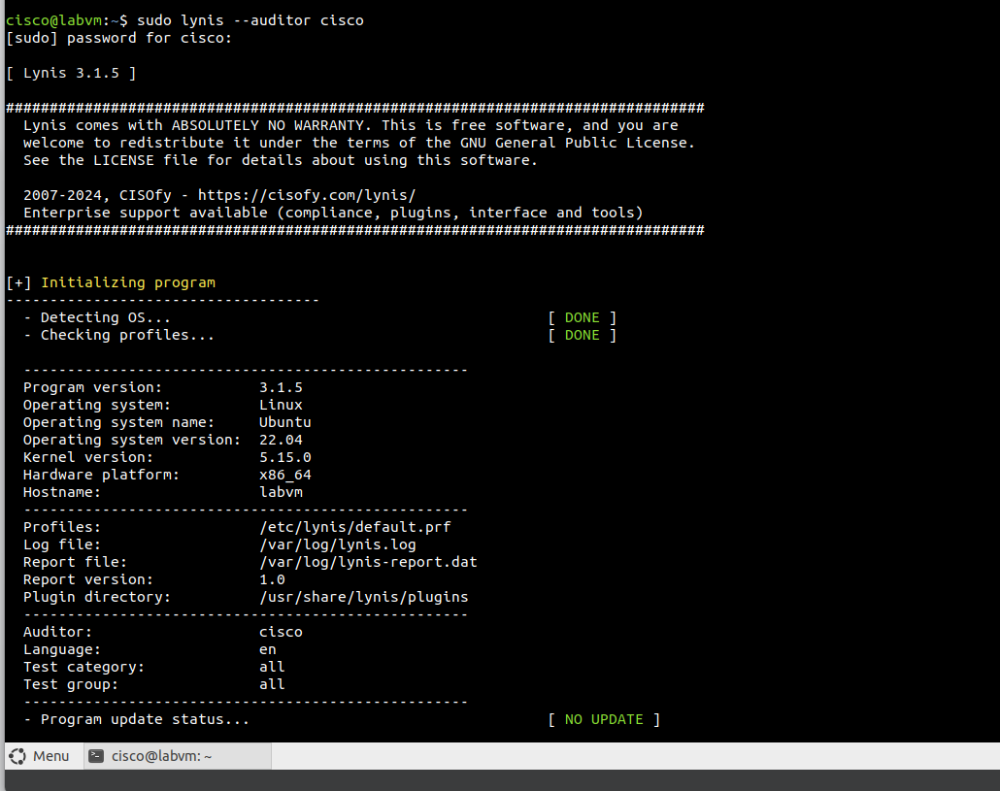
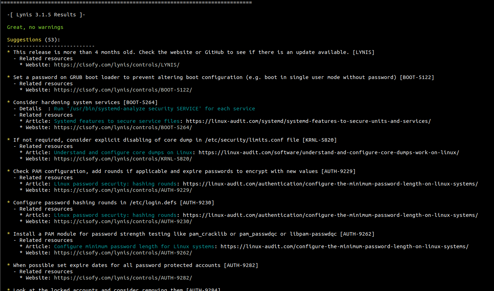
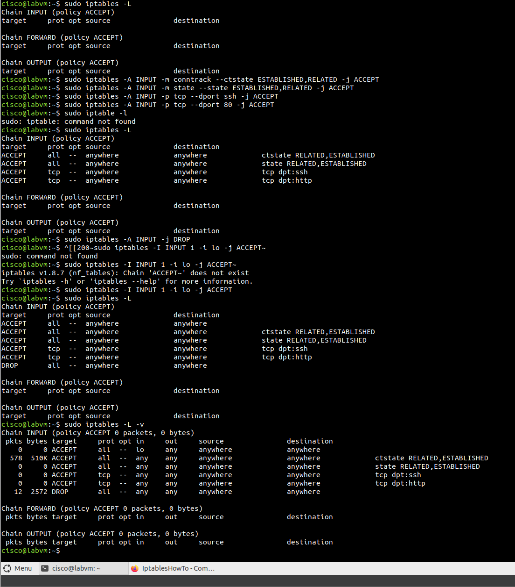
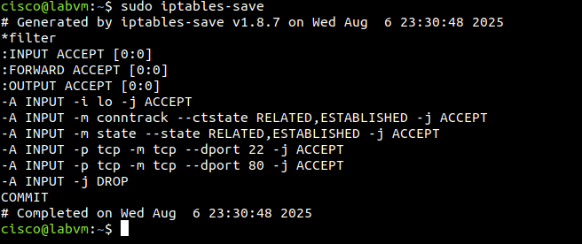
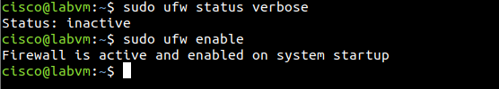

# Lab: Linux System Hardening with Lynis

##  Objective
Audit a Linux virtual machine using Lynis and apply hardening techniques to fix system-level security warnings.

##  Tools Used
- **Lynis 3.1.5**
- **Ubuntu 22.04**
- **iptables**
- **ufw**

##  Key Steps Performed
1. Installed and updated Lynis
2. Performed a full system scan with `sudo lynis --auditor cisco`
3. Identified one warning and 50+ suggestions
4. Applied iptables firewall rules to resolve [FIRE-4512]
5. Enabled UFW to persist firewall state on reboot
6. Re-scanned and confirmed the warning was resolved

##  Warning Fixed
> `iptables module(s) loaded, but no rules active [FIRE-4512]`

##  Fix Applied
- Added rules to accept SSH and HTTP traffic
- Dropped all other INPUT traffic
- Saved rules using `iptables-save`
- Enabled UFW to persist configuration

##  Screenshots

| Before | After |
|--------|-------|
|  |  |

**Firewall Configuration Steps:**
- 
- 
- 

##  Lessons Learned
- How to scan and interpret a Lynis security audit
- How to configure and apply basic iptables rules
- Using UFW to enforce firewall policies on startup

---

> This lab shows how to identify and fix basic system-level security issues on a Linux VM using CLI tools.

## MITRE ATT&CK Mapping
- [T1562.004: Disable or Modify System Firewall](https://attack.mitre.org/techniques/T1562/004/)

---

> **Author:** Komiljon Karimov  
> **Mission:** Upskilling into Cybersecurity
