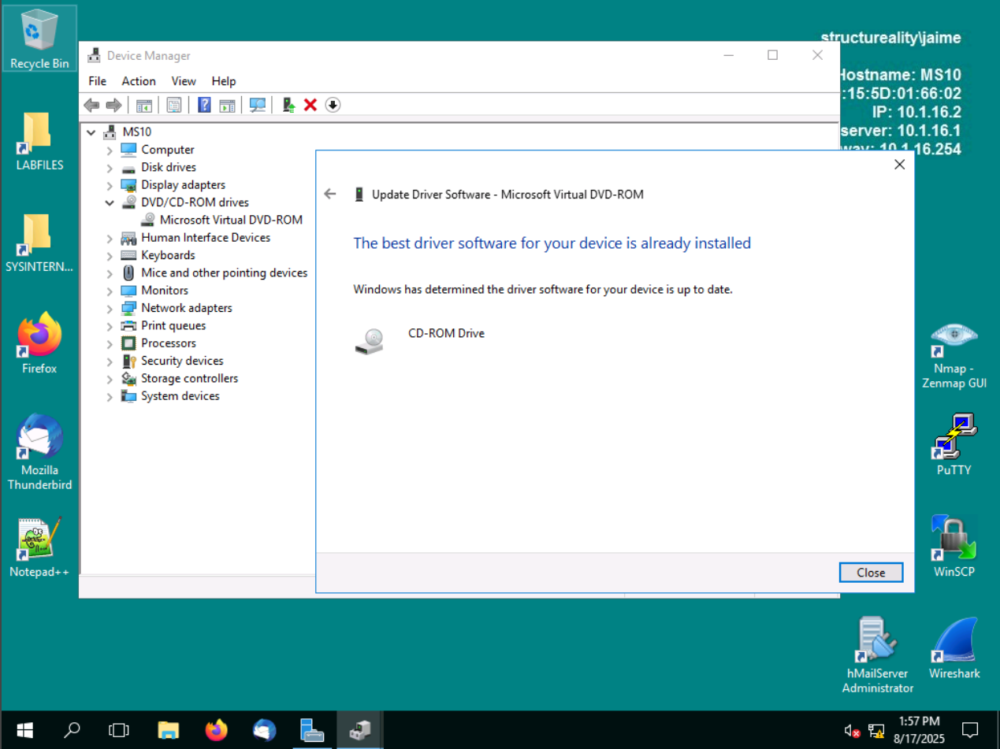
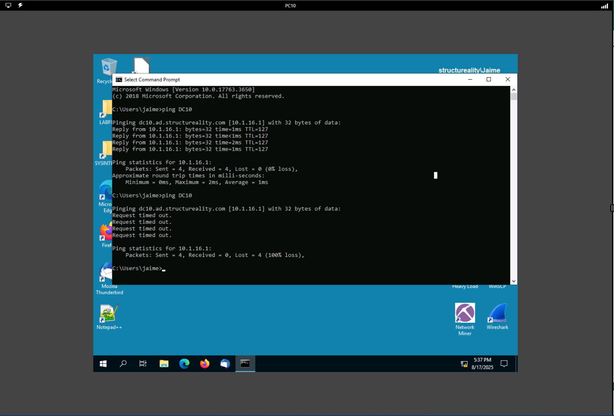

# Lab: Performing System Hardening

##  Scenario
In this lab, I went hands-on with **system hardening** — securing both Windows and Linux machines in a simulated corporate environment (Structureality Inc.).  
The idea was simple: reduce the attack surface by **removing what isn’t needed** and **updating and securing what is needed**.  
But the execution wasn’t that simple. Hardening is an iterative grind — update, remove, test, repeat — and I got to see firsthand why companies treat it as an ongoing cycle instead of a one-time fix.  

##  Objectives
This lab helped me practice real-world CySA+ objectives:  
- **1.1**: Understanding system and network architecture in the context of security.  
- **2.5**: Vulnerability response, handling, and management.  

##  Environment & Tools
I worked across several virtual machines:  
- **KALI Linux** (for hosts file manipulation and permissions)  
- **DC10** (Windows Server 2019, domain controller + secure web server)  
- **MS10** (Windows Server 2016)  
- **PC10** (Windows Server 2019 client machine)  

And used:  
- Linux terminal (`wget`, `nano`, `chmod`)  
- Windows CMD and PowerShell  
- Device Manager & Server Manager  
- Windows Defender Firewall with Advanced Security  

---

##  What I Did

### 1. Managing Device Drivers on Windows
Hardening starts even with something as boring as drivers. Old or insecure drivers can create vulnerabilities, so I checked the **MS10 server** for outdated device drivers.  

- Opened **Device Manager** and scanned for hardware changes.  
- Manually updated the driver for the virtual CD-ROM device.  
- Verified that the driver was already the latest version, so no action needed here.  

 *Screenshot proof:*  
  
  

---

### 2. Manipulating Hosts File on Linux
Next, I jumped into the **Kali VM** to mess with DNS resolution using the `/etc/hosts` file. This is something attackers abuse, but defenders can also leverage it for hardening.

- First, I ran `wget juiceshop.local` to see how it resolved. It hit the correct IP (203.0.113.228), and I saw the `index.html` file downloaded.  
- Checked the `/etc/hosts` file — and yes, it had an entry for `juiceshop.local`.  

  
  

- Then I purposely **broke it** by editing the hosts file in nano, changing the IP to `203.0.113.249`.  
- Retested with `wget` → as expected, the connection failed because the system was now resolving to a bad IP.  

  
  
  

- Finally, I fixed it again — set it back to the right IP (`203.0.113.228`) and confirmed with another `wget`. This time it connected and downloaded `index.html.1`.  

  
  

**Takeaway**: The `/etc/hosts` file always overrides DNS. This means you can block, redirect, or enforce name resolution locally, but it’s also a risk if attackers drop in malicious mappings.  

---

### 3. Removing Unneeded Applications and Services
Another big part of hardening is simple: **get rid of junk**. Every unnecessary app or service is just another attack surface. On the **MS10 server**, I did two things:

1. **Removed CPUID CPU-Z**  
   - Opened **Programs and Features**  
   - Selected CPUID CPU-Z and uninstalled it — since this tool wasn’t needed in production.  
   - Confirmed it was completely removed.  

  
  

2. **Removed the insecure FTP service**  
   - Launched **Server Manager** → *Remove Roles and Features*.  
   - Selected the **FTP Server** role and removed it.  
   - Confirmed the removal progress — Windows even restarted after to finalize.  

  
  
  

**Takeaway**: It’s easy to forget about “harmless” tools and leftover services, but attackers love exploiting those. Hardening is just as much about subtraction as addition.

---

### 4. Hardening with Firewall Rules (ICMP Blocking)
Next came the firewall work. The requirement was to **block ICMP traffic** between DC10 and PC10. Here’s how it went:

- First test: from **PC10**, I pinged **DC10**. Replies came back instantly.  
  
  

- Second test: from **DC10**, I pinged **PC10**. As expected, PC10’s firewall was already blocking ICMP — all I got were timeouts.  
  
  

So clearly, **PC10 was secure**, but **DC10 still replied to ICMP requests**. That had to change.

- I opened **Windows Defender Firewall with Advanced Security** on DC10.  
- Located the inbound rule for **File and Printer Sharing (Echo Request - ICMPv4-In)** and set it to **Block the connection**.  
- Did the same for ICMPv6.  

  
  

- After applying the rule, I retested the ping from PC10 to DC10 — this time, total silence: all requests timed out. Exactly what I wanted.  

 
  

**Takeaway**: In Windows Firewall, simply disabling a rule isn’t enough because other “allow” rules might still let traffic through. A **deny rule always wins**. That’s why explicit blocks are the safest way to enforce policy.

---

### 5. Setting File Permissions on Linux
Finally, I went back into the **Kali machine** to tackle Linux file permissions. This part was all about using both **symbolic** and **octal** notation to harden files.

- I started with **demofile.sh**, which had overly broad access.  
- Using `chmod 710 demofile.sh`, I locked it down so the **owner had full control, the group could only execute, and others had no access**.  
- Verified with `ls -l` → it showed exactly as `-rwx--x---`.  

  
  

---

Next, I practiced with **testfile.txt** using **symbolic notation**:  
- `chmod u+x testfile.txt` → gave execute to the owner.  
- `chmod g+w testfile.txt` → gave write to the group.  
- `chmod go-r,u-x testfile.txt` → took away read from group/others and execute from owner.  
- Each time I confirmed the changes with `ls -l`.  

  
  

---

Finally, I used **octal notation** to apply common permission sets:  
- `chmod 777 testfile.txt` → full access for everyone.  
- `chmod 644 testfile.txt` → owner read/write, group read, others read (the “normal” safe default).  
- Watched the file flip between wide-open and properly restricted.  

  
  

**Takeaway**: Playing with these permissions reminded me how small changes (a single `+x` or `-r`) can completely change who has control over a file. In the wrong hands, a lazy permission setting can expose sensitive scripts to everyone on the system.

---

##  Lessons Learned
- **System hardening is iterative** — update, remove, validate, repeat. It’s not glamorous, but it’s the bread-and-butter of keeping systems safe.  
- Even simple things like a **hosts file entry** or a **forgotten service** can be exploited if left unchecked.  
- **Windows Firewall** taught me a valuable lesson: disabling isn’t enough — explicit denies are the real enforcement.  
- **Linux permissions** gave me muscle memory with both symbolic and octal notation, which is essential for quick hardening in production environments.  

---

##  Personal Reflection
What struck me most about this lab is how “ordinary” tasks — uninstalling a tool, editing a text file, blocking ping — are actually the frontline of defense in real organizations.  
It’s not always about flashy tools or AI-driven detection. Sometimes, it’s literally about **removing what you don’t need, tightening what you do, and verifying at each step**.  

For me, this wasn’t just about checking boxes to complete a lab. It was a reminder that as a future analyst, I’ll be doing exactly this kind of work: chasing down misconfigurations, cleaning up loose ends, and documenting the process so others can trust the systems I’ve hardened.  

---

## MITRE ATT&CK Mapping
- [T1222: File and Directory Permissions Modification](https://attack.mitre.org/techniques/T1222/)

---

> **Author:** Komiljon Karimov  
> **Mission:** Upskilling into Cybersecurity
