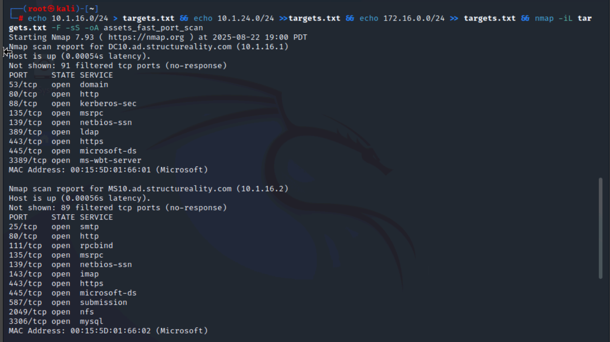

# Lab 01: Performing Asset Discovery with Nmap

>  In this lab, I used `nmap` to perform asset discovery across three network segments (servers, clients, DMZ).  
> I identified live hosts, open ports, running services, and operating systems — validating network inventory and detecting potential rogue devices.  
> This simulates the daily workflow of a SOC analyst during the reconnaissance and asset management phase.
> 
##  Objective
The purpose of this lab was to practice the process of **asset discovery** across multiple subnets using `nmap`.  
As a cybersecurity analyst, I simulated a real-world scenario: verifying the accuracy of an organization’s device inventory and detecting any **unauthorized or rogue systems** connected to the network.  

Subnets scanned:  
- **Server subnet:** `10.1.16.0/24`  
- **Client subnet:** `10.1.24.0/24`  
- **Screened subnet (DMZ):** `172.16.0.0/24`  

##  Tools Used
- **Kali Linux (root terminal)**  
- **Nmap 7.93**  

##  Key Steps Performed

1. **Ping Sweeps**  
   - Used `nmap -sn` to detect live hosts across each subnet.  
   - Saved results into `.nmap` output files.  

        

2. **SYN Fast Port Scan**  
   - Created `targets.txt` with all three subnets.  
   - Ran a **top-100 TCP port SYN scan** using:  
     ```bash
     nmap -iL targets.txt -F -sS -oA assets_fast_port_scan
     ```
   - Captured results in `.nmap`, `.gnmap`, `.xml`.  

     
     

3. **Version Detection (Service Enumeration)**  
   - Ran version scans on discovered hosts to identify running services and applications:  
     ```bash
     nmap -iL targets.txt -F -sS -sV -oN service_versions.nmap
     ```
   - Identified services like **DNS, HTTP, Kerberos, LDAP, SMTP, IMAP, MySQL, SSH**.  

     
     

4. **OS Detection**  
   - Used OS fingerprinting with:  
     ```bash
     nmap -iL targets.txt -F -sS -O -oN asset_OSes.nmap
     ```
   - Detected multiple operating systems:  
     - **Windows Server 2016**  
     - **Linux kernel 4.x/5.x**  
     - **FreeBSD 11.x**  

     
     
     

##  Screenshots
All screenshots are saved in the [`screenshots/`](./screenshots/) folder.  
Each image highlights an important step: ping sweeps, port scans, version scans, and OS detection.  

## MITRE ATT&CK Mapping
- [T1046: Network Service Discovery](https://attack.mitre.org/techniques/T1046/)

##  Lessons Learned
- **Ping sweeps alone are unreliable** — some hosts block ICMP, requiring additional scans.  
- **SYN scans** provide stealthy, fast results for identifying open ports.  
- **Version scans** reveal critical service details (e.g., Kerberos, MySQL, IIS) that SOC analysts can use for vulnerability assessment.  
- **OS fingerprinting** helps classify systems in the network inventory and spot unauthorized devices.  
- This lab reinforced the importance of **layered discovery methods** when validating assets against official inventory.  

---

 **Outcome:** Successfully identified live hosts, open ports, running services, and operating systems across three network segments — simulating a real SOC analyst workflow for asset discovery.

---

> **Author:** Komiljon Karimov  
> **Mission:** Upskilling into Cybersecurity
