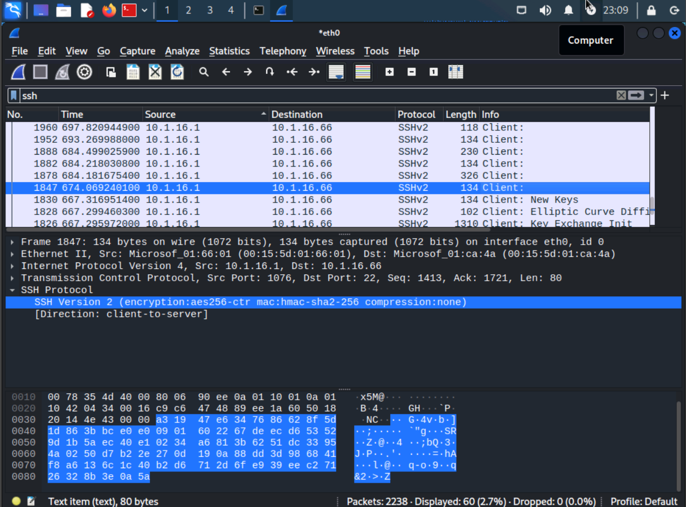

# Lab 02: Passive Scanning with Wireshark

> In this lab, I used **Wireshark** to perform passive vulnerability scanning by capturing ICMP and SSH traffic.  
> I identified plaintext vs encrypted communications, determined operating system fingerprints from packet payloads, and analyzed SSH protocol details.  
> This simulates the tasks of a SOC analyst when monitoring traffic for vulnerabilities and policy compliance.

##  Objective
The goal of this lab was to use Wireshark as a **passive network analysis tool** to:  
- Capture and filter network traffic.  
- Inspect ICMP traffic to detect blocked traffic and identify OS types.  
- Differentiate plaintext vs encrypted communication.  
- Identify client and server software versions from SSH traffic.  

##  Tools Used
- **Kali Linux VM** (running Wireshark)  
- **Windows DC10 VM** (for generating ICMP and SSH traffic)  
- **PuTTY** (for SSH client)  
- **Wireshark v4.0.x**  

## Lab Environment Setup

This directory includes a Vagrantfile that provisions a Kali VM and a Windows VM on a private network for traffic capture.

### Build & Run

```bash
vagrant up
```

Access Kali with `vagrant ssh kali` and access Windows via RDP at `192.168.56.11`.


##  Key Steps Performed

1. **Launching Wireshark and Starting Capture**  
   - Opened Wireshark on Kali, selected `eth0` interface, and started packet capture.  
   - Verified three-pane layout for packet list, details, and bytes.  
     

2. **ICMP Traffic Analysis**  
   - Sent ping requests from Kali to DC10 (`ping 10.1.16.1 -c 4`).  
   - Captured packets showed ICMP echo requests and replies with payload visible in plaintext.  
     
     

3. **Firewall Blocking ICMP**  
   - On DC10, applied a Windows firewall rule to block inbound ICMP.  
   - Verified packet loss (`100% packet loss`) in Kali and ICMP requests with no replies in Wireshark.  
     
     

4. **OS Identification via ICMP Payload**  
   - Observed ICMP payload differences:  
     - Windows used `abcdefghijklmnopqrstuvwabcdefghi`.  
     - Linux used ASCII symbols/numbers.  
   - Used packet size (32 vs 48 bytes) as another OS indicator.  
     

5. **SSH Traffic Analysis**  
   - Connected from DC10 → Kali using PuTTY (client) and OpenSSH (server).  
   - Captured SSH handshake packets.  
   - Verified protocol version and software:  
     - Client: `SSH-2.0-PuTTY_Release_0.77`  
     - Server: `SSH-2.0-OpenSSH_9.1p1 Debian-1`  
     
     

6. **Encryption Detection**  
   - Inspected SSH session setup (Key Exchange, Diffie-Hellman, AES-256-CTR, HMAC-SHA2-256).  
   - Confirmed that post-handshake payloads were unreadable in ASCII (encrypted).  
     

## MITRE ATT&CK Mapping
- [T1040: Network Sniffing](https://attack.mitre.org/techniques/T1040/)

##  Screenshots
All supporting evidence is saved in the [`screenshots/`](./screenshots/) folder.  
The 12 images highlight:  
- ICMP payload analysis.  
- Firewall blocking behavior.  
- OS fingerprinting via packet size and payload.  
- SSH version identification.  
- Encryption in use (unreadable payload).  

##  Lessons Learned
- **Passive scanning** is powerful: Wireshark reveals host behavior without sending probes.  
- **ICMP payloads** can fingerprint operating systems based on ASCII patterns and packet size.  
- **Plaintext protocols** expose sensitive data (ICMP payload, unencrypted traffic).  
- **Encrypted protocols** (SSH) protect confidentiality but still reveal metadata like client/server versions.  
- Analysts must **validate findings** (to avoid false positives) and tie results to organizational security policy.  

---

**Outcome:** Successfully demonstrated passive traffic analysis with Wireshark — identifying OS types, detecting firewall rules, and distinguishing plaintext from encrypted communications.

---

> **Author:** Komiljon Karimov  
> **Mission:** Upskilling into Cybersecurity
