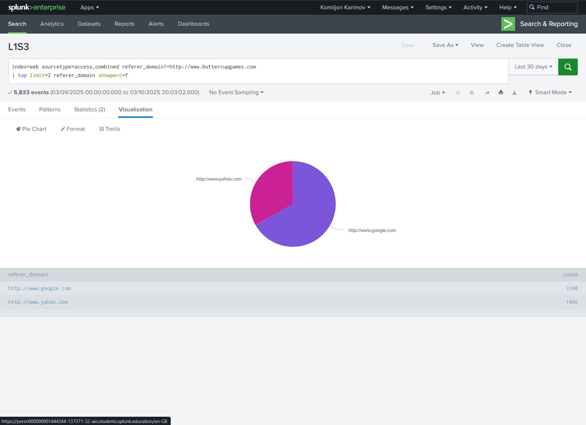

# Lab 07 — Splunk Statistical Processing (Charts • Timecharts • Stats • Eval • Formatting)

In this lab I practiced how to **transform**, **manipulate**, and **present** machine data so decision-makers can read it in seconds. I stayed close to real stakeholder asks: usage trends for security, referrer patterns for marketing, badge counts for Facilities, and revenue slices for Sales.


## Objectives

- Build multi-series charts with `timechart` and `chart`.
- Slice and format with `stats`, `eval`, `where`, `sort`, `rename`, `fields`.
- Convert units correctly using `round()` and `pow()`.
- Tell clear stories from logs that non-technical teams can act on.

---

## Environment & Tools

- **Splunk Enterprise** → *Search & Reporting* app  
- Indexes used: `web`, `sales`, `security`, `network`, `games`  
- Time ranges: *Last 24 hours*, *Last 30 days*, *Previous week*, *All time*  
- Dataset synopsis (from lab brief):
  - `index=network sourcetype=cisco_wsa_squid` → web security appliance
  - `index=security sourcetype=linux_secure` → web server auth
  - `index=security sourcetype=history_access` → badge readers (Facilities)
  - `index=web sourcetype=access_combined` → online store logs
  - `index=sales sourcetype=vendor_sales` → retail sales entries

---

## How to Reproduce

1. Open **Search & Reporting**.
2. Paste the SPL exactly as shown under each task.
3. Set the **time range** specified per task.
4. Save as a **Report** with the *ID* I used (LxSy) to keep parity with my screenshots.

---

## Repository Structure

```
Lab07_Splunk_Statistical_Processing/
├─ README.md
├─ artifacts/
│  └─ Splunk lab6.pdf
└─ screenshots/
   ├─ L1S1.png … L3X.png
```

---

# Lab Exercise 1 — Transforming Data

### Scenario A — Internet usage by category (last 24h)

**Ask (Network):** “Show internet usage volume by category so we can spot spikes.”  
**Approach:** `timechart` a **count** of events split by `usage`.

**SPL**
```spl
index=network sourcetype=cisco_wsa_squid
| timechart count by usage
```

**Result:** Multi-series line of *Borderline, Business, Personal, Unknown, Violation*.  


**Why it matters**
- Baseline by category. Easy to alert on out-of-family hours or unusual categories.

**Takeaways**
- `timechart … by <field>` quickly pivots categories over time.
- Use fixed windows like *Last 24 hours* for comparable day-over-day checks.

---

### Scenario B — Top IPs for Accepted vs Failed (last 24h)

**Ask (Security):** “Which IPs generate Accepted vs Failed on the web server?”  
**Approach:** `chart count over vendor_action by src_ip` with top 10 and no OTHER.

**SPL**
```spl
index=security sourcetype=linux_secure vendor_action!="session opened"
| chart count over vendor_action by src_ip limit=10 useother=f
```

**Result:** Column chart, Accepted vs Failed split per `src_ip`.  


**Takeaways**
- Limiting the dimension keeps the chart legible.
- Removing `OTHER` is useful when you want only the heavy hitters.

---

### Scenario C — External referrer domains (last 30d)

**Ask (Sales & Marketing):** “Which external sites send us traffic?”  
**Approach:** Filter out our own domain and `top` the rest.

**SPL**
```spl
index=web sourcetype=access_combined referer_domain!="http://www.buttercupgames.com"
| top limit=2 referer_domain showperc=f
```

**Result:** Google and Yahoo lead referrers.  


**Takeaways**
- `showperc=f` keeps the table clean when counts are enough.
- Filtering the house domain avoids self-referrals skewing the picture.

---

### Scenario D — Badged-in employees per site (last 24h)

**Ask (Facilities):** “How many unique people entered each office?”  
**Approach:** Distinct count of `Username` per `Address_Description`.

**SPL**
```spl
index=security sourcetype=history_access
| stats dc(Username) by Address_Description
| rename dc(Username) as "Badged-in Employees"
```

**Result:** San Francisco highest, then London, Boston.  


**Takeaways**
- `dc()` avoids double counting repeated swipes.
- Bar charts are the most honest visual here.

---

### Optional E — Rare MIME types (last 24h)

**Ask (Security):** “Surface uncommon content types. Rare can be risky.”  
**Approach:** `rare` on `cs_mime_type`.

**SPL**
```spl
index=network sourcetype=cisco_wsa_squid
| rare cs_mime_type limit=3
```

**Result:** Three rare types identified.  


**Takeaways**
- Rare ≠ malicious, but these become good starting points for hunting.

---

### Optional F — NA best-selling products (previous week)

**Ask (Sales):** “Top 5 products in USA and Canada last week.”  
**Approach:** `chart count by VendorCountry product_name` with `limit=5 useother=f` and custom axis labels.

**SPL**
```spl
index=sales sourcetype=vendor_sales VendorID<4000
| chart count by VendorCountry product_name limit=5 useother=f
```

**Result:** Side-by-side USA vs Canada, top products only.  
  


**Takeaways**
- `useother=f` keeps “Other” from diluting the top-N story.
- Formatting axes to business language helps non-analysts.

---

# Lab Exercise 2 — Manipulating Data with `eval`

### Scenario G — Weekly actions: totals, averages, revenue (previous week)

**Ask (Sales):** “By action type, show total events, average price, and total amount.”  
**Approach:** `stats` + `eval` rounding and renaming, then sort by revenue.

**SPL**
```spl
index=web sourcetype=access_combined
| stats count AS "Total Events" avg(price) AS avg_price sum(price) AS total_amount BY action
| eval "Average Price"=round(avg_price,2), "Total Amount"=round(total_amount,2)
| fields action "Total Events" "Average Price" "Total Amount"
| sort - "Total Amount"
```

**Result:** Clear table ranked by revenue contribution.  


**Takeaways**
- Do math in raw names, then present with business-friendly labels.
- Round late to preserve precision during calculation.

---

### Scenario H — Daily web volume in MB (previous week)

**Ask (Networking):** “How much data do web servers serve per day?”  
**Approach:** Sum request `bytes` per day, convert to megabytes using `pow()`.

**SPL**
```spl
index=web sourcetype=access_combined
| timechart sum(bytes) as bytes
| eval megabytes = round(bytes/pow(1024,2), 2)
| fields - bytes
```

**Result:** Line chart and table, MB per day.  
  


**Takeaways**
- `pow(1024,2)` keeps the unit math explicit and readable.
- Always remove staging fields (`bytes`) once the derived field is ready.

---

### Optional I — GET/POST ratio per host (last 4h)

**Ask (Networking):** “For each web server, what’s the GET:POST ratio?”  
**Approach:** Pivot methods by host and compute ratio, rounded for reporting.

**SPL**
```spl
index=web sourcetype=access_combined
| chart count over host by method
| eval Ratio = round(GET/POST, 2)
```

**Result:** Stable ~2:1 across hosts in this window.  


**Takeaways**
- Ratios are fragile if denominators can be zero; add guards if needed.
- Rounding to 2 decimals is usually enough for operational conversations.

# Lab Exercise 3 — Formatting & Scenario Synthesis

### Scenario J — Hours where web revenue > 2× retail (last 24h)

**Ask (Sales):** “Find hours when online sales outperformed retail by 2×.”  
**Approach:** Union `web` purchase events with `sales` entries, sum price per hour by index, filter with `where`, rank by `web`.

**SPL**
```spl
(index=web sourcetype=access_combined action=purchase status=200) OR (index=sales sourcetype=vendor_sales)
| timechart sum(price) span=1h by index
| where web > sales*2
| sort -web
```

**Result:** Ranked hours with unusually strong online revenue.  


**Takeaways**
- Using `span=1h` aligns the business question with the aggregation window.
- `where` after transforms keeps the search efficient and readable.

---

### Scenario K — Best sellers > $15k in 30 days

**Ask (Sales):** “Which products cleared $15,000 online?”  
**Approach:** Aggregate, filter, round, rename, sort.

**SPL**
```spl
index=web sourcetype=access_combined status=200 action=purchase
| stats sum(price) as sales by product_name
| where sales >= 15000
| eval sales = round(sales, 0)
| sort - sales
| rename product_name as "Best Sellers", sales as "Total Revenue"
```

**Result:** Two products cross the threshold in this dataset.  


**Takeaways**
- Apply currency rounding at presentation time; store raw sums for auditability.
- Naming columns to business language (“Best Sellers”, “Total Revenue”) matters.

---

### Optional L — Top 2 status codes per host, sorted

**Ask (ITOps):** “Show top two HTTP status codes for each web host.”  
**Approach:** `top … by host`, hide raw counts, sort host asc and percent desc.

**SPL**
```spl
index=web sourcetype=access_combined
| top status limit=2 by host
| fields - count
| sort host, -percent
```

**Result:** Clear per-host distribution, dominated by `200` with occasional `503`.  


**Takeaways**
- Removing `count` reduces noise when `percent` is the message.
- Sorting by host then `-percent` groups and ranks cleanly.

---

## Saved Reports Index

| ID   | Title / Purpose                                              | Time Range       |
|------|--------------------------------------------------------------|------------------|
| L1S1 | Internet usage categories over time                          | Last 24 hours    |
| L1S2 | Accepted vs Failed by top 10 source IPs                      | Last 24 hours    |
| L1S3 | Top external referrer domains                                | Last 30 days     |
| L1S4 | Unique badged-in employees per office                        | Last 24 hours    |
| L1X1 | Rare MIME types                                              | Last 24 hours    |
| L1X2 | NA top-5 products by country                                 | Previous week    |
| L2S1 | Weekly totals, averages, revenue by action                   | Previous week    |
| L2S2 | Daily web MB served                                          | Previous week    |
| L2X1 | GET:POST ratio per host                                      | Last 4 hours     |
| L3S1 | Hours when web revenue > 2× retail                           | Last 24 hours    |
| L3S2 | Products with >$15k revenue                                  | Last 30 days     |
| L3X  | Top 2 HTTP status codes per host                             | Last 24 hours    |

---

## Lessons Learned

- **Transform first, filter second.** `timechart`/`stats` → `where` keeps intent clean and execution fast.
- **Name for the audience.** `rename` and field order via `fields` make the output instantly readable.
- **Round deliberately.** Round for presentation, not during intermediate math.
- **Limit and remove.** `limit=…`, `useother=f`, and `fields - …` tighten the story.
- **Pow for units.** `pow(1024,2)` improves clarity over hardcoded `1048576`.

---

## Personal Reflection

I approached every chart and table like a small product with a clear customer. I started from the stakeholder’s question, wrote SPL that literally answers it, then trimmed the output until it read like a headline. I kept the data honest and lean: no “OTHER,” no extra columns, no vague labels. The result is fast, readable views that help non-technical teams decide in seconds. If Sales or Facilities can glance once and act, that’s the standard I want for my SIEM work.

---

## MITRE ATT&CK Mapping

This lab is **analytics-foundation** work. It does not target a single technique; it builds baselines and KPIs that support detection and triage later. Relevant data sources per ATT&CK: *Web logs, Network traffic, Application logs*. No direct technique mapping claimed.

---

## Troubleshooting Notes

- **Zeros in denominators:** guard ratios with `if(POST=0, null(), GET/POST)`.
- **Quiet categories:** `fillnull value=0` before math if charts look broken.
- **Time buckets:** choose `span` that matches the question (hourly vs daily).

---

## Credits

- Dataset and prompts from Splunk Education lab brief: [`Guided lab content`](./artifacts/Splunk%20lab6.pdf)

---
```spl
# Quick SPL Cheat Sheet Used
sort [N] [-]<field>         # limit and order results
where <eval-expression>     # post-transform filtering
rename a AS "A" b AS "B"    # business-friendly labels
fields [-] <list>           # include/exclude columns
stats <fn>(x) BY y          # aggregations
timechart <fn>(x) BY y      # time-based aggregations
eval z = round(x/pow(1024,2),2)
top <field> limit=N by k useother=f showperc/f
rare <field> limit=N
```

> If you clone this repo and paste the SPL under each task with the same time ranges, you will reproduce my results and visuals one-for-one.

````

---

> **Author:** Komiljon Karimov  
> **Mission:** Upskilling into Cybersecurity
