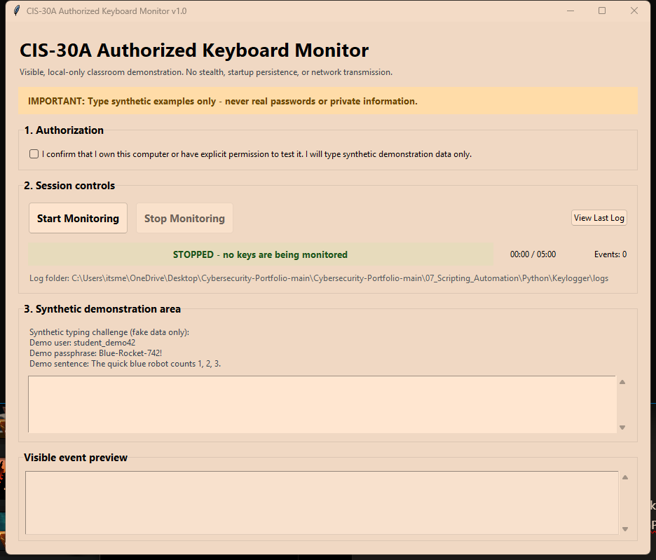

# Python Authorized Keyboard Monitor

> In this project, I built a visible, consent-gated Python keyboard monitor for an authorized CIS-30A classroom lab. The application demonstrates how keyboard events can be captured, represented as structured data, displayed in a graphical interface, and written to a local audit-style log. Safety controls deliberately prevent the project from behaving like a covert keylogger.

## Objective

The goal of this project was to apply core Python concepts to a security-relevant automation problem while keeping the demonstration ethical, transparent, and limited in scope.

The finished application:

- requires an explicit authorization checkbox before a session can begin;
- displays a persistent **ACTIVE** or **STOPPED** state;
- captures printable and special-key events with `pynput`;
- stores timestamped events as dictionaries in a Python list;
- reconstructs readable synthetic text and writes a detailed local timeline;
- stops through the interface, the Escape key, or a five-minute limit; and
- excludes stealth, persistence, credential targeting, remote control, network transmission, and security-tool evasion.

## Authorized-Use Statement

This project is intended only for systems I own or have explicit permission to test. Demonstrations must use synthetic information—never real passwords, personal messages, payment data, or other sensitive content.

## Tools Used

- **Python 3** — application logic, object-oriented design, and file handling
- **Tkinter / ttk** — visible authorization, controls, status, timer, typing area, and log viewer
- **pynput 1.8.1** — local keyboard-event listener
- **unittest** — automated validation with a fake listener that never monitors the real keyboard
- **pathlib** — platform-aware paths and restricted local-log access
- **Windows batch scripts** — guided environment setup and application launch

## Application Preview

The screenshot below shows the application before authorization. Monitoring is stopped, the event count is zero, and the Start control is presented alongside the consent requirement.



## Key Features and Workflow

1. **Confirm authorization.** The user must confirm ownership or explicit permission and agree to enter synthetic data only.
2. **Start a visible session.** The interface changes to an active warning state, disables duplicate starts, begins the timer, and focuses the demonstration area.
3. **Capture structured events.** Each key press is recorded as a dictionary containing an ISO-formatted timestamp and a readable key label.
4. **Preview activity.** The interface shows the latest events and live event count so capture is never hidden.
5. **Stop safely.** The Stop button, Escape key, application close action, or five-minute limit finalizes the session.
6. **Create a local report.** `LogManager` writes the session summary, readable reconstruction, and complete event timeline to a uniquely named UTF-8 text file.
7. **Review the output.** The last generated file can be opened inside the application; path validation prevents the viewer from reading files outside the project log folder.

## Project Structure

```text
Keylogger/
|-- main.py                    # Creates application objects and starts Tkinter
|-- config.py                  # Shared labels, paths, and safety limits
|-- keyboard_monitor.py        # Event capture, key formatting, and consent subclass
|-- log_manager.py             # Session summaries, reconstruction, and local output
|-- ui.py                      # Tkinter interface and session coordination
|-- requirements.txt           # Pinned external dependency
|-- setup_windows.bat          # Creates .venv and installs dependencies
|-- run_app.bat                # Starts the app with the project environment
|-- tests/
|   `-- test_project.py        # Safe tests built around a fake listener
|-- screenshots/
|   `-- authorized-keyboard-monitor.png
|-- logs/
|   |-- sample_synthetic_log.txt
|   `-- session_*.txt          # Locally generated demonstration output
|-- course-submission/         # Standalone simplified CIS-30A submission
|-- CHANGELOG.md               # Development milestones
|-- .gitignore                 # Excludes environments, caches, and new session logs
`-- README.md
```

### Program Responsibilities

| File | Purpose |
|---|---|
| `main.py` | Creates `AuthorizedKeyboardMonitor`, `LogManager`, and `KeyloggerApp` objects, then starts the GUI event loop. |
| `config.py` | Centralizes the app name, authorization language, log location, preview limit, demo prompt, and five-minute session cap. |
| `keyboard_monitor.py` | Formats printable and special keys, manages the listener lifecycle, stores event dictionaries, and enforces consent through inheritance. |
| `log_manager.py` | Builds summaries, reconstructs readable text, creates unique UTF-8 logs, and restricts the in-app viewer to the local logs directory. |
| `ui.py` | Builds the interface, updates session state, safely transfers listener events to Tkinter, and coordinates saving and viewing logs. |
| `tests/test_project.py` | Verifies core behavior without creating a real global keyboard listener. |
| `course-submission/` | Preserves the separate, simplified version prepared for course delivery, including its own source files, dependency file, README, and demonstration logs. |

## Installation and Use on Windows

Install a current Python 3 release and keep the **tcl/tk and IDLE** component enabled. Then either double-click `setup_windows.bat`, or open PowerShell in this folder and run:

```powershell
py -m venv .venv
.venv\Scripts\python.exe -m pip install -r requirements.txt
.venv\Scripts\python.exe main.py
```

For an authorized demonstration:

1. Read and select the authorization checkbox.
2. Select **Start Monitoring**.
3. Click the synthetic demonstration area and enter only fake sample text.
4. Select **Stop Monitoring** or press **Esc**.
5. Select **View Last Log** to inspect the locally generated report.

## Testing and Validation

The test suite uses `FakeListener` and `FakeKey` objects; it does not attach to the real keyboard.

```powershell
.venv\Scripts\python.exe -m unittest discover -s tests -v
```

The 12 automated tests cover:

- authorization acceptance and rejection;
- printable and special-key formatting;
- event storage and session shutdown;
- Escape-key handling;
- duplicate-start and inactive-stop behavior;
- isolation between consecutive sessions;
- readable handling of Space, Enter, and Backspace;
- UTF-8 session-log creation;
- rejection of viewer paths outside `logs/`; and
- invalid log-location handling.

**Validation result:** all 12 tests passed on July 21, 2026.

## Sample Synthetic Output

```text
SESSION SUMMARY
Duration: 12.4 seconds
Event count: 18
Stop reason: Esc key pressed

READABLE CAPTURE
student_demo42
```

A sanitized example is available in [`logs/sample_synthetic_log.txt`](logs/sample_synthetic_log.txt). Files named `session_*.txt` are runtime artifacts and should contain synthetic demonstration data only.

## Python Concepts Demonstrated

- variables, strings, Boolean validation, conditionals, functions, and explicit loops;
- lists containing timestamped event dictionaries;
- built-in and custom exceptions;
- custom modules and the external `pynput` package;
- classes, objects, methods, callbacks, and inheritance;
- thread-safe state management with `RLock`;
- local file operations with `pathlib`; and
- GUI event handling with Tkinter.

## MITRE ATT&CK Mapping

- [T1056.001: Input Capture — Keylogging](https://attack.mitre.org/techniques/T1056/001/) — studied here in a visible, permission-based lab to understand the behavior defenders may need to identify.

## Security Controls and Defensive Relevance

- **Explicit consent:** capture cannot start until the authorization control is selected.
- **No covert operation:** the interface, live state, event count, and preview remain visible.
- **Time limitation:** sessions stop automatically after five minutes.
- **Local-only storage:** the program contains no network or remote-control capability.
- **Restricted viewer:** generated logs can only be opened from the configured local log directory.
- **Synthetic-data guidance:** the interface and log header warn against entering real secrets.

Understanding event-capture behavior helps defenders recognize why unfamiliar background processes, unexpected startup entries, unsigned applications, and endpoint-protection alerts deserve investigation. Least privilege, application allow-listing, endpoint monitoring, patching, and multi-factor authentication all reduce risk, although MFA does not make keylogging harmless.

## Limitations

- Endpoint security software may alert on authorized keyboard monitoring.
- Tkinter requires a Python installation that includes Tcl/Tk.
- Keyboard layouts and operating systems may label some keys differently.
- Readable reconstruction does not emulate every editor action, shortcut, cursor movement, Caps Lock state, or international input method.
- Logs are plain text and are suitable only for non-sensitive classroom demonstrations.
- The application is not a service and is not intended for covert, persistent, or remote use.

## Lessons Learned

- Security tooling needs clear scope and guardrails, even in a classroom environment.
- Separating capture, logging, configuration, and interface responsibilities makes the code easier to test and explain.
- Dependency injection enables meaningful testing without activating sensitive operating-system behavior.
- Timestamped structured events support both human-readable reporting and future automation.
- Visible status, consent, time limits, and local-only storage turn an otherwise risky concept into a controlled learning exercise.

---

**Outcome:** Successfully developed and validated a modular Python application that demonstrates authorized input-capture mechanics, structured event logging, GUI design, object-oriented programming, and defensive security considerations.

---

> **Author:** Komiljon Karimov  
> **Mission:** Upskilling into Cybersecurity
