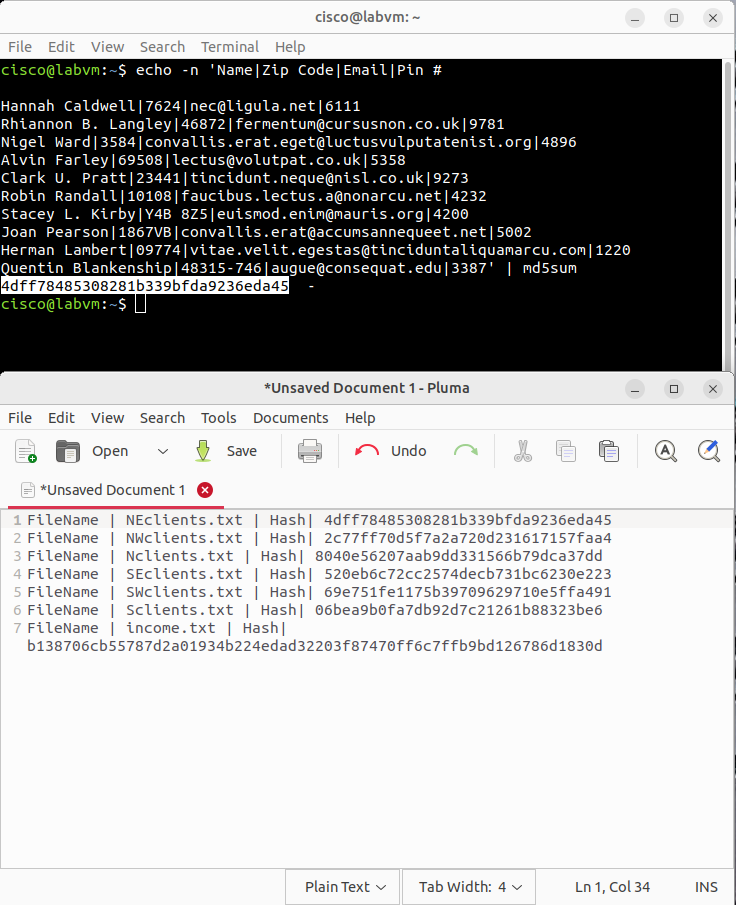

# Packet Tracer – File and Data Integrity Checks (Lab 154.10.1.13)

## Objective

This Packet Tracer scenario walks through a realistic incident where client data was encrypted and exfiltrated by an attacker.  
My goal in there, as a role of Mike, is to restore the compromised files from a backup, verify their integrity using cryptographic hashes, identify any files that have been tampered with, and then use a keyed hash (HMAC) to validate a sensitive financial file, and gathering all the necessary information, report to my supervisor Sally about the incident.   

From a security operations (SOC/GRC) perspective this lab reinforces two key concepts:

- **Data integrity matters:** after any cyber‑attack it is a must to verify that backups and restored files are unaltered before trusting them again.  
- **Cryptographic assurance:** simple hashes detect accidental or malicious changes, while HMAC adds authentication so only those with the secret key can produce the same digest.

## Tools Used

- **Cisco Packet Tracer** – to simulate the branch and HQ networks, FTP/HTTP servers and laptops.  
- **CSE‑LABVM (Linux)** running in VirtualBox – used for calculating file hashes and HMACs.  
- **FTP client & Web browser** inside Packet Tracer – to download backups from HQ and view compromised web pages.  
- **Pluma text editor** – to store original hash values and view file contents.  
- **`md5sum` & `openssl`** – command‑line tools on the lab VM for hashing and HMAC generation.  

## Key Steps Performed

1. **Identify the incident and download backups.**  
   - Logged into the branch laptop and visited the intranet site.  Instead of client files the page displayed a ransomware message (“Your files are GONE!”), confirming the breach.  
   - Retrieved the original file hash values from the HQ website and saved them in a text file on the lab VM.  
   - Used the Packet Tracer FTP client to connect to the HQ server and download six client files (`NEclients.txt`, `NWclients.txt`, `Nclients.txt`, `SEclients.txt`, `SWclients.txt` and `Sclients.txt`) as a potential replacement dataset.

2. **Verify integrity using MD5 hashing.**  
   - Opened each downloaded file in Pluma and copied its contents to the lab VM.  
   - Generated an MD5 hash with `echo -n 'contents' | md5sum` and compared it against the stored hashes.  
   - Five files matched their expected values.  Three files (`Nclients.txt`, `NEclients.txt` `NWclients.txt`) produced a different hash, indicating tampering.  

3. **Report and isolate the tampered file.**  
   - Wrote an email to the branch supervisor describing the compromise and attached the list of hashes.  
   - On the supervisor’s laptop (HQ‑Laptop‑1), connected to the HQ FTP server using the supervisor’s credentials and downloaded the suspicious file for forensic analysis.

4. **Validate a critical financial file with HMAC.**  
   - On the CFO’s laptop, located the `income.txt` file containing sensitive financial data.  
   - Copied its contents to the lab VM and generated a keyed SHA‑256 HMAC using `openssl dgst -sha256 -hmac cisco123 income.txt`.  
   - Compared the computed HMAC (`b138706cb55787d2a01934b224ed…`) with the original HMAC stored in Pluma.  They matched, proving the file had not been altered since the last backup.  
   - Reflected on why HMAC provides stronger assurance than a simple hash: the secret key prevents an attacker from forging the same digest, ensuring both integrity and authenticity of the data.

## MITRE ATT&CK Mapping
- [T1565: Data Manipulation](https://attack.mitre.org/techniques/T1565/)

## Screenshots

The numbered images in this folder capture the most important steps in the investigation:

| Step | Description | Image |
|-----|-------------|------|
|1|Branch laptop shows a ransomware message; initial MD5/HMAC checks on the lab VM.||
|2|FTP session on the branch laptop downloading client data from the HQ server.||
|3|Listing of the downloaded files on the branch machine.||
|4|Hashing the NE and NW client files – hashes match the trusted values.||
|5|Hashing the Nclients file – hash differs from the stored value, indicating tampering.||
|6|Hashing additional client files (SE and SW) for completeness.||
|7|Supervisor’s FTP session downloading the suspicious file(s) from the HQ server for analysis.||
|8|Computing a keyed SHA‑256 HMAC for the `income.txt` file using OpenSSL – the digest matches the original.||

## Lessons Learned / SOC & GRC Relevance

- **Always verify backups before restoring:** retrieving data from an FTP server isn’t enough – you must confirm the files haven’t been tampered with. Using hashes provides a quick integrity check before trusting a backup.  
- **Hash values don’t lie but they aren’t foolproof:** MD5 hashes make it obvious when a file changes, but anyone can recompute the hash. An attacker could replace both the file and the hash list. HMAC solves this by mixing in a secret key.  
- **Simple tools have big value:** command‑line utilities like `md5sum` and `openssl` can be scripted to automate integrity checks across many files. In a SOC environment, similar commands would be integrated into SIEM/SOAR playbooks.  
- **Incident reporting and escalation are crucial:** discovering the tampered file wasn’t the end – notifying the supervisor and isolating the suspect data ensured the right teams could investigate further.  
- **Real‑world application:** digital forensics teams routinely hash disk images and evidence files to prove they haven’t been altered. GRC professionals also rely on checksums to validate the integrity of policy documents, software binaries and audit logs. Understanding how to generate and verify both hashes and HMACs is foundational for roles across cybersecurity.

---

This lab provided hands‑on experience responding to a data‑integrity incident, reinforcing why cryptographic checks are essential in SOC and GRC workflows. By practicing these steps in a simulated environment you build muscle memory that translates directly to real‑world cyber investigations.

---

> **Author:** Komiljon Karimov  
> **Mission:** Upskilling into Cybersecurity
