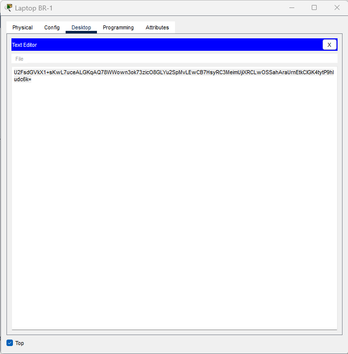
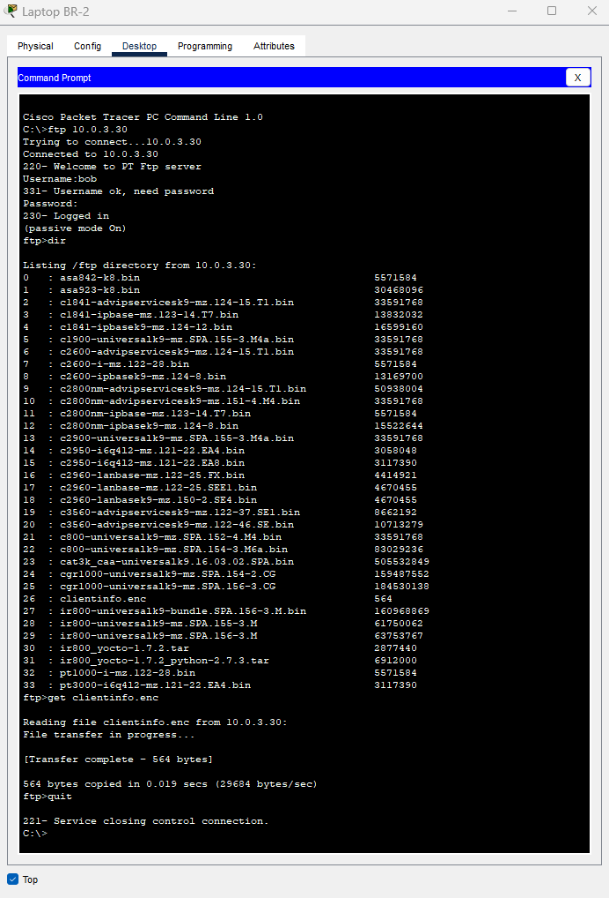
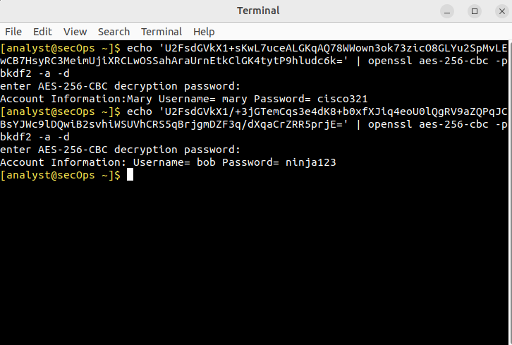
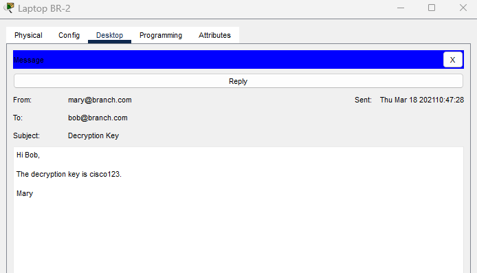
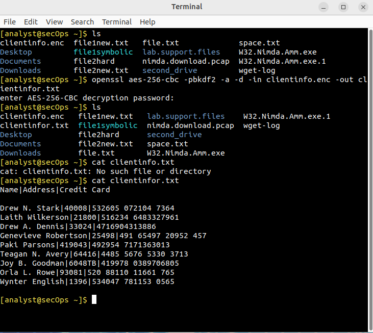

# Packet Tracer – File & Data Encryption (Lab02)

## Objective

In this lab, I stepped into the role of both **sender** and **recipient** in a simulated secure file exchange between two branch office employees, Mary and Bob.  
My mission was to:

1. Retrieve encrypted FTP credentials for each user.
2. Use those credentials to transfer an encrypted file.
3. Decrypt the file using a provided key.
4. Validate that the process protected the data in transit.

**Why This Matters:**  
In real-world SOC and GRC operations, securing sensitive data during transfer is a daily responsibility. This lab mirrors a common compliance requirement — ensuring **confidentiality, controlled access, and proper key management** — making it directly applicable to PCI DSS, HIPAA, and other security frameworks.

---

## Tools Used

- **Cisco Packet Tracer** – to simulate the branch office network and FTP infrastructure.
- **OpenSSL** – for AES-256-CBC encryption/decryption with PBKDF2 key derivation.
- **FTP Client (Windows CMD)** – to upload and download files.
- **Linux VM (CSE-LABVM)** – to run decryption commands and handle file operations.
- **Pluma Text Editor** – to view and manage decrypted text.

---

## Key Steps Performed

1. **Decrypting Mary’s FTP Credentials**  
   - Accessed Mary’s laptop and found an encrypted text file containing her FTP login.
   - Copied the ciphertext into the lab VM terminal.
   - Used:
     ```bash
     openssl aes-256-cbc -pbkdf2 -a -d
     ```
     with the provided password (`maryftp123`) to reveal:  
     **Username:** `mary` | **Password:** `cisco321`

2. **Uploading Encrypted Client Data**  
   - Verified that `clientinfo.enc` contained ciphertext, not plaintext.
   - Connected to the Branch Server via FTP using Mary’s credentials.
   - Uploaded `clientinfo.enc` to the server for Bob to retrieve.

3. **Decrypting Bob’s FTP Credentials**  
   - Accessed Bob’s laptop, found his encrypted login file.
   - Used the same OpenSSL method with password `bobftp123` to reveal:  
     **Username:** `bob` | **Password:** `ninja123`

4. **Downloading the Encrypted File as Bob**  
   - Logged into the FTP server using Bob’s credentials.
   - Located and downloaded `clientinfo.enc` to his machine.

5. **Receiving the Decryption Key from Mary**  
   - Opened Bob’s email and retrieved the key: `cisco123`.

6. **Decrypting the Confidential Data**  
   - On the lab VM, ran:
     ```bash
     openssl aes-256-cbc -pbkdf2 -a -d -in clientinfo.enc -out clientinfo.txt
     ```
     using the password from Mary’s email.
   - Viewed the decrypted `clientinfo.txt` file — containing customer names, addresses, and credit card data.

---

## MITRE ATT&CK Mapping
- [T1027: Obfuscated/Compressed Files and Information](https://attack.mitre.org/techniques/T1027/)

## Screenshots

| Step | Description | Image |
|------|-------------|-------|
| 1 | Mary’s encrypted FTP credentials in her text file. |  |
| 2 | Decrypting both Mary and Bob’s credentials using OpenSSL. |  |
| 3 | Bob’s FTP session downloading the encrypted `clientinfo.enc` file. |  |
| 4 | Email from Mary with the decryption key. |  |
| 5 | Successful decryption of the file and viewing of sensitive client data. |  |

---

## Lessons Learned / SOC & GRC Relevance

- **Encryption secures data in transit** – even if intercepted, the file was unreadable without the key.
- **Credential protection is critical** – storing login data in encrypted form prevents immediate compromise if accessed by unauthorized parties.
- **Key distribution matters** – Mary sent the decryption key separately via email, which is better than sending it in the same channel, but still not the most secure option in production.
- **Weaknesses in the method** – AES-256-CBC is strong, but the lab used a **weak key derivation function** and lacked integrity checks. In real-world environments, modern AEAD algorithms (like AES-GCM) with robust KDFs (like HKDF) should be used.
- **Practical SOC value** – this exercise reflects scenarios such as **secure file transfer, insider workflows, and controlled access to sensitive data**, all of which are common in compliance frameworks (e.g., PCI DSS, HIPAA).

---

**Real-World Takeaway:**  
This lab was a hands-on reminder that cryptography is not just about “locking” data, but about managing **the entire chain of trust** — from credential protection, to file encryption, to secure key exchange. Even small weaknesses in any part of that chain can undermine the whole system.

---

> **Author:** Komiljon Karimov  
> **Mission:** Upskilling into Cybersecurity
