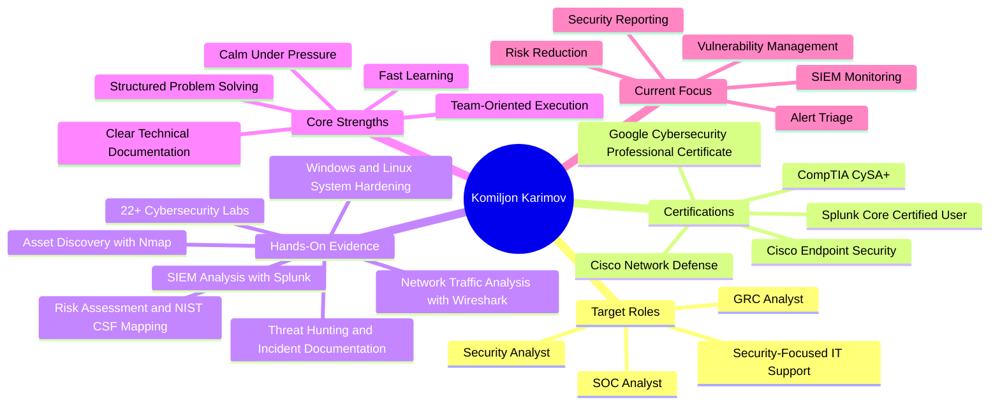

<!-- Banner -->

  

  <a href="https://www.linkedin.com/in/komiljon-karimov-secops"><b>LinkedIn</b></a>

  <b>Cybersecurity Analyst | SOC • GRC • Security Operations • IT Support</b> 
  Ontario, CA | Inland Empire • Greater Los Angeles • Remote • Open to Relocation

  I turn noisy logs, risk findings, and technical evidence into clear security actions.

  

## About Me

I am Komiljon Karimov, a cybersecurity professional transitioning from engineering, education, and technical consulting into security operations and GRC. I completed the Per Scholas Cybersecurity Program and earned CompTIA CySA+, Splunk Core Certified User, Google Cybersecurity Professional Certificate, and multiple Cisco security/networking badges.

My portfolio is built to show practical evidence: SIEM searches, packet analysis, risk assessments, system hardening, threat hunting, vulnerability analysis, incident notes, and clear technical documentation. I am currently continuing my cybersecurity and IT apprenticeship-track studies through Riverside City College while preparing for roles where I can contribute immediately and keep growing.

  

## Career Objective

Target roles: **SOC Analyst**, **Security Analyst**, **GRC Analyst/Associate**, and **IT Support roles with security responsibilities**.

I am especially interested in work involving SIEM monitoring, alert triage, incident documentation, vulnerability management, Windows/Linux hardening, risk assessment, security controls, and clear stakeholder communication.

  

## Current Highlights

- **CompTIA CySA+ earned** with a score of **811/900**
- **Splunk Core Certified User** with hands-on SPL, dashboards, alerts, reports, lookups, time-based searches, and statistical processing labs
- **Google Cybersecurity Professional Certificate** completed
- **Cisco training and badges** across Network Defense, Endpoint Security, Networking Basics, Operating Systems Basics, and Computer Hardware Basics
- **22+ hands-on cybersecurity labs** across SIEM, threat hunting, GRC, network security, host hardening, web security, cryptography, and incident response
- Practical IT/security experience supporting small-business operations, secure access, endpoint protection, VPN basics, credential hygiene, and website administration

  
<b>Open Cybersecurity Profile Map</b>

```mermaid
mindmap
  root((Komiljon Karimov))
    Target Roles
      SOC Analyst
      Security Analyst
      GRC Analyst
      Security-Focused IT Support
    Certifications
      CompTIA CySA+
      Splunk Core Certified User
      Google Cybersecurity Professional Certificate
      Cisco Network Defense
      Cisco Endpoint Security
    Hands-On Evidence
      22+ Cybersecurity Labs
      SIEM Analysis with Splunk
      Network Traffic Analysis with Wireshark
      Asset Discovery with Nmap
      Risk Assessment and NIST CSF Mapping
      Windows and Linux System Hardening
      Threat Hunting and Incident Documentation
    Core Strengths
      Structured Problem Solving
      Clear Technical Documentation
      Calm Under Pressure
      Fast Learning
      Team-Oriented Execution
    Current Focus
      SIEM Monitoring
      Alert Triage
      Vulnerability Management
      Risk Reduction
      Security Reporting
```

  

## What This Portfolio Demonstrates

| Area | Evidence Shown |
|---|---|
| **Security Operations** | Splunk searches, dashboards, alerts, field extraction, statistical processing, and incident notes |
| **Network Security** | Wireshark packet analysis, Nmap asset discovery, protocol filtering, basic network mapping |
| **GRC & Risk** | Risk assessments, NIST CSF mapping, asset inventory, likelihood/impact scoring, control recommendations |
| **System Hardening** | Linux and Windows baselines, access control, permissions, secure configuration, remediation checklists |
| **Threat Hunting** | Hypothesis-driven hunts, IOC review, suspicious behavior analysis, findings, and remediation actions |
| **Incident Response** | Incident handler journals, triage notes, root-cause thinking, lessons learned, and MITRE ATT&CK mapping |
| **Technical Communication** | Scenario-based README files, clear artifacts, stakeholder-friendly summaries, and recruiter-readable documentation |

  

## Portfolio Map

- **01_GRC_Compliance/** — risk assessment, controls, frameworks, policy, ethics
- **02_Linux_Windows_Security/** — permissions, logging, Linux/Windows hardening, secure baselines
- **03_Network_Security/** — asset discovery, Nmap, network visibility, diagrams
- **04_SIEM_Log_Analysis/** — Splunk searches, dashboards, alerts, time analysis, statistics, lookups
- **05_Incident_Response_Forensics/** — incident notes, triage, documentation, investigation workflow
- **06_Threat_Intel_Vuln_Analysis/** — threat hunting, IOCs, vulnerability assessment
- **07_Scripting_Automation/** — Bash, PowerShell, Python, automation practice
- **08_Web_App_Attacks/** — SQL injection, filtering, input validation concepts
- **09_Cryptography_Encryption/** — hashing, integrity checks, encryption, OpenSSL practice

> Each major lab is written with a scenario, objectives, tools, steps, artifacts, lessons learned, and security role mapping.

  

## Featured Labs 

| Domain | Lab | What It Shows |
|---|---|---|
| **SIEM & Statistical Analysis** | [Splunk Statistical Processing](04_SIEM_Log_Analysis/Lab07_Splunk_Statistical_Processing) | SPL searches, stats/eval transformations, multi-series timecharts, and stakeholder-ready security reporting |
| **Network & PCAP Analysis** | [Passive Scanning with Wireshark](04_SIEM_Log_Analysis/Lab02_Passive_Scanning_Wireshark) | Packet capture review, protocol filtering, suspicious pattern analysis, and ATT&CK T1040 mapping |
| **Threat Hunting** | [Threat Hunting Case Study](06_Threat_Intel_Vuln_Analysis/Lab03_Threat_Hunting) | Hunt methodology, custom queries, findings, remediation thinking, and analyst-style documentation |
| **Risk & GRC** | [Botium Toys Risk Assessment](01_GRC_Compliance/Lab02_Botium_Toys_Risk_Assessment) | Asset inventory, risk matrix, likelihood/impact scoring, control gaps, and practical GRC reporting |
| **System Hardening** | [Performing System Hardening](02_Linux_Windows_Security/Lab03_Performing_System_Hardening) | Windows/Linux hardening, before/after baselines, remediation checklist, and secure configuration practice |
| **Network Asset Discovery** | [Asset Discovery with Nmap](03_Network_Security/Lab01_Asset_Discovery) | Scan profiles, host identification, network visibility, and simple network documentation |

  
<b>Full Lab Index by Domain</b>

#### 01 — GRC & Compliance
- [Botium Toys Risk Assessment](01_GRC_Compliance/Lab02_Botium_Toys_Risk_Assessment)
- [Applying the NIST CSF](01_GRC_Compliance/Lab03_Applying_NIST_CSF)

#### 02 — Linux & Windows Security
- [Linux Permissions Lab](02_Linux_Windows_Security/Lab01_LinuxPermissions)
- [Lynis Hardening Audit](02_Linux_Windows_Security/Lab02_Linux_Hardening_Lynis)
- [Performing System Hardening](02_Linux_Windows_Security/Lab03_Performing_System_Hardening)
- [File Permissions & Access Control](02_Linux_Windows_Security/Lab04_File_Permissions)

#### 03 — Network Security
- [Asset Discovery with Nmap](03_Network_Security/Lab01_Asset_Discovery)

#### 04 — SIEM & Log Analysis
- [Splunk 1 — Using Fields](04_SIEM_Log_Analysis/01_Splunk_logs)
- [Passive Scanning with Wireshark](04_SIEM_Log_Analysis/Lab02_Passive_Scanning_Wireshark)
- [Splunk Search Optimisation](04_SIEM_Log_Analysis/Lab03_Splunk_Search_optimisation)
- [Splunk Scheduling Reports & Alerts](04_SIEM_Log_Analysis/Lab04_Scheduling_Reports_and_Alerts)
- [Splunk Visualizations](04_SIEM_Log_Analysis/Lab05_Splunk_Visualizations)
- [Splunk — Working with Time](04_SIEM_Log_Analysis/Lab06_Splunk_Working_with_time)
- [Splunk Statistical Processing](04_SIEM_Log_Analysis/Lab07_Splunk_Statistical_Processing)
- [Splunk Lookups & Subsearches](04_SIEM_Log_Analysis/Lab08_Splunk_Leveraging_Lookups_and_Subsearches)

#### 05 — Incident Response & Forensics
- [Incident Handler Journal](05_Incident_Response_Forensics/Lab02_Incident_Handler_Journal)

#### 06 — Threat Intel & Vulnerability Analysis
- [Vulnerability Assessment](06_Threat_Intel_Vuln_Analysis/Lab02_Vulnerability_Assessment)
- [Threat Hunting Lab](06_Threat_Intel_Vuln_Analysis/Lab03_Threat_Hunting)

#### 07 — Scripting & Automation
- Bash, PowerShell, and Python automation practice

#### 08 — Web Application Security
- [SQL Injection Discovery](08_Web_App_Attacks/Lab01_SQL_Injection)
- [SQL Filtering Lab](08_Web_App_Attacks/Lab02_SQL_Filtering)

#### 09 — Cryptography & Encryption
- [File Integrity Checks](09_Cryptography_Encryption/Lab01_File_Data_Integrity_Checks)
- [File Data Encryption](09_Cryptography_Encryption/Lab02_File_Data_Encryption)

  

## Skills Snapshot

| Category | Tools & Methods |
|---|---|
| **SIEM & Detection** | Splunk, SPL, dashboards, alerts, reports, field extraction, regex, `stats`, `eval`, `timechart`, `tstats`, Job Inspector |
| **Network & PCAP Analysis** | Wireshark, Nmap, TCP/IP, DNS, DHCP, protocol analysis, asset discovery, basic network diagrams |
| **Operating Systems** | Linux CLI, Windows administration, file permissions, logging, secure baselines, endpoint hardening |
| **GRC & Compliance** | Risk assessment, asset inventory, NIST CSF, controls mapping, likelihood/impact scoring, policy-aware reporting |
| **Incident Response** | Alert triage, incident notes, investigation workflow, root-cause analysis, lessons learned, MITRE ATT&CK mapping |
| **Threat Intel & Vulnerability** | IOC review, threat hunting, vulnerability assessment methodology, remediation recommendations |
| **Scripting & Automation** | Bash, PowerShell, basic Python, OpenSSL, task automation, repeatable documentation |
| **IT Support & Administration** | Microsoft 365, Google Workspace, VPN basics, antivirus/firewall rollout, credential hygiene, user support documentation |

  

## Tools & Technologies

  
  
  
  
  
  
  
  
  
  
  
  
  
  

  

## Certifications & Training

  
  
  

**Cisco Badges**

  
  
  
  
  

**Additional Training**

- Per Scholas Cybersecurity Program — Los Angeles, CA | Completed October 2025
- Riverside City College CE740 Cybersecurity / Apprenticeship Track — 2026
- CompTIA A+ preparation through CIS coursework and Cisco IT Essentials 8

  

## Professional Background

Before cybersecurity, I built a foundation in engineering, education, IT support, and technical consulting. That background helps me communicate clearly, document carefully, stay calm under pressure, and connect technical work to business risk.

Recent work includes supporting secure small-business operations at 4Prep Academy: website administration, access management, basic VPN setup, antivirus/firewall rollout, device hardening, credential hygiene, documentation, and practical troubleshooting for users and systems.

  

## Current Focus

I am strengthening my readiness for SOC, GRC, and security-focused IT roles by focusing on:

- SIEM monitoring, alert triage, and incident documentation
- Windows/Linux administration and endpoint hardening
- Networking fundamentals, packet analysis, and asset discovery
- Vulnerability management and remediation prioritization
- Risk assessment, NIST CSF, and security control mapping
- Ticket-style documentation and clear security reporting
- CompTIA A+ foundation review to support IT/security hybrid roles

  

## Contact

If you are hiring for an entry-level SOC, Security Analyst, GRC, or IT Support role with security responsibilities, I am ready to contribute, learn quickly, and bring disciplined documentation to the team.

  <a href="https://www.linkedin.com/in/komiljon-karimov-secops"><b>Connect with me on LinkedIn</b></a>

© 2026 Komiljon Karimov — Cybersecurity Portfolio. Viewing and linking permitted. Reuse or derivatives require written permission.
