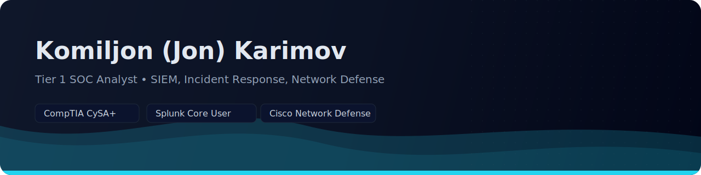

<!-- Banner -->

  

  <a href="./Komiljon_Karimov_Resume.pdf"><b>Resume</b></a> •
  <a href="https://www.linkedin.com/in/komiljon-karimov-secops"><b>LinkedIn</b></a>

SOC Analyst. I turn logs into detections and incidents into lessons.**

  

## Objective
Target roles: **Tier-1 SOC Analyst (SIEM + IR)** and **GRC Analyst**.  
Ready to start immediately and open to relocation nationwide.

  

## Recent Wins
- **CompTIA CySA+** 811/900 (Sep 2025)
- 12+ hands-on labs (Splunk searches, IR journal, Nmap asset discovery)
- Cisco badges: Network Defense, Endpoint Security, OS/Network Basics

  

## Portfolio Map
- **01_GRC_Compliance/** — risk, audits, policy, ethics  
- **02_Linux_Windows_Security/** — permissions, logging, hardening  
- **03_Network_Security/** — Packet Tracer, ACLs, routing, NAT  
- **04_SIEM_Log_Analysis/** — Splunk searches, dashboards, alerts  
- **05_Incident_Response_Forensics/** — playbooks, triage, forensics  
- **06_Threat_Intel_Vuln_Analysis/** — IOCs, threat hunting, vuln scans  
- **07_Scripting_Automation/** — Bash, PowerShell, automation tasks  
- **08_Web_App_Attacks/** — SQLi, XSS, input validation  
- **09_Cryptography_Encryption/** — TLS, hashes, integrity, encryption  

> Every lab README includes scenario, objectives, steps, artifacts, lessons learned, and SOC role mapping.

  

## Featured Hands-on Labs 

| Skill | Associated Lab | Evidence / Standards |
|---|---|---|
| SIEM & Network Traffic Analysis | [Passive Scanning with Wireshark](04_SIEM_Log_Analysis/Lab02_Passive_Scanning_Wireshark) | pcap + filters • NIST IR: Detection/Analysis • ATT&CK T1040 |
| Threat Hunting Case Study | [Threat Hunting Lab](06_Threat_Intel_Vuln_Analysis/Lab03_Threat_Hunting) | hunt query + findings • NICE: Cyber Defense Analyst |
| Network Asset Discovery | [Asset Discovery with Nmap](03_Network_Security/Lab01_Asset_Discovery) | scan profile + host list |
| System Hardening | [Performing System Hardening](02_Linux_Windows_Security/Lab03_Performing_System_Hardening) | baseline deltas + checklist |
| GRC Risk Assessment | [Botium Toys Risk Assessment](01_GRC_Compliance/Lab02_Botium_Toys_Risk_Assessment) | risk matrix + controls |
| Data Integrity Verification | [File Integrity Checks](09_Cryptography_Encryption/Lab01_File_Data_Integrity_Checks) | hashes + verification log |

  
<b>More labs</b>

- [File Data Encryption](09_Cryptography_Encryption/Lab02_File_Data_Encryption)  
- [Linux Permissions Lab](02_Linux_Windows_Security/Lab01_LinuxPermissions)  
- [Lynis Hardening Audit](02_Linux_Windows_Security/Lab02_Linux_Hardening_Lynis)  
- [SQL Injection Discovery](08_Web_App_Attacks/Lab01_SQL_Injection)  
- [SQL Filtering Lab](08_Web_App_Attacks/Lab02_SQL_Filtering)  
- [Incident Handler Journal](05_Incident_Response_Forensics/Lab02_Incident_Handler_Journal)

  

## Tools

  
  
  
  
  
  
  
  
  

  

## Certifications

  
  
  

### Cisco Badges

  
  
  
  
  

  

> If you’re hiring for an entry-level SOC role, let’s connect.

© 2025 Komiljon Karimov — Cybersecurity Portfolio. Viewing and linking permitted. Reuse or derivatives require written permission.

