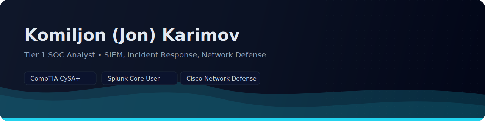

<!-- Banner -->

  

  <a href="https://www.linkedin.com/in/komiljon-karimov-secops"><b>LinkedIn</b></a>

**SOC Analyst & GRC Enthusiast. I turn logs into detections and incidents into lessons.**

  

## Objective
Target roles: **Tier‑1 SOC Analyst (SIEM + IR)** and **GRC Analyst/Associate**.  
Ready to start immediately; open to remote and relocation.

  

## Highlights & Recent Wins
- **CompTIA CySA+**: score 811/900 (Sep 2025)  
- **22 hands-on labs** delivered across SIEM, threat hunting, GRC, network/host security, and scripting  
- **Cisco badges**: Network Defense, Endpoint Security, Network Basics, OS Basics, Hardware Basics  
- Ongoing learning in high-demand skills: cloud security, detection/response, network defense, application security, compliance, ethical hacking, analytical problem-solving  
- Portfolio structured for recruiters: clear intro, concise skills list, quantifiable achievements, and pinned projects

  

## Portfolio Map
- **01_GRC_Compliance/** — risk, audits, policy, ethics  
- **02_Linux_Windows_Security/** — permissions, logging, hardening  
- **03_Network_Security/** — Packet Tracer, ACLs, routing, NAT  
- **04_SIEM_Log_Analysis/** — Splunk searches, dashboards, alerts  
- **05_Incident_Response_Forensics/** — playbooks, triage, forensics  
- **06_Threat_Intel_Vuln_Analysis/** — IOCs, threat hunting, vuln scans  
- **07_Scripting_Automation/** — Bash, PowerShell, automation tasks  
- **08_Web_App_Attacks/** — SQLi, XSS, input validation  
- **09_Cryptography_Encryption/** — TLS, hashes, integrity, encryption  

> Each lab README includes scenario, objectives, steps, artifacts, lessons learned, and SOC/GRC mapping.

  

## Top Labs — Featured Showcases  

| Domain | Lab | Key Deliverables |
|---|---|---|
| **SIEM & Search Optimization** | [Splunk Search Optimisation](04_SIEM_Log_Analysis/Lab03_Splunk_Search_optimisation) | Efficient queries using `tstats`; dashboards & Job Inspector analysis; cost–performance trade‑off |
| **Network & PCAP Analysis** | [Passive Scanning with Wireshark](04_SIEM_Log_Analysis/Lab02_Passive_Scanning_Wireshark) | Clean packet captures, protocol filters; evidence of suspicious patterns; ATT&CK T1040 |
| **Threat Hunting & Intel** | [Threat Hunting Case Study](06_Threat_Intel_Vuln_Analysis/Lab03_Threat_Hunting) | Hunt methodology, custom queries, findings and remediation actions |
| **Risk & GRC** | [Botium Toys Risk Assessment](01_GRC_Compliance/Lab02_Botium_Toys_Risk_Assessment) | Asset inventory, risk matrix, likelihood/impact calculation, controls mapping |
| **System Hardening** | [Performing System Hardening](02_Linux_Windows_Security/Lab03_Performing_System_Hardening) | Before/after baselines, remediation checklist, scripts used |
| **Network Asset Discovery** | [Asset Discovery with Nmap](03_Network_Security/Lab01_Asset_Discovery) | Scan profiles, host identification, network diagram |

  
<b>Full Lab Index (by domain)</b>

#### 01 — GRC & Compliance
- [Botium Toys Risk Assessment](01_GRC_Compliance/Lab02_Botium_Toys_Risk_Assessment)
- [Applying the NIST CSF](01_GRC_Compliance/Lab03_Applying_NIST_CSF)

#### 02 — Linux & Windows Security
- [Linux Permissions Lab](02_Linux_Windows_Security/Lab01_LinuxPermissions)
- [Lynis Hardening Audit](02_Linux_Windows_Security/Lab02_Linux_Hardening_Lynis)
- [Performing System Hardening](02_Linux_Windows_Security/Lab03_Performing_System_Hardening)
- [File Permissions & Access Control](02_Linux_Windows_Security/Lab04_File_Permissions)

#### 03 — Network Security
- [Asset Discovery with Nmap](03_Network_Security/Lab01_Asset_Discovery)

#### 04 — SIEM & Log Analysis
- [Splunk 1 – Using Fields](04_SIEM_Log_Analysis/01_Splunk_logs)
- [Passive Scanning with Wireshark](04_SIEM_Log_Analysis/Lab02_Passive_Scanning_Wireshark)
- [Splunk Search Optimisation](04_SIEM_Log_Analysis/Lab03_Splunk_Search_optimisation)
- [Splunk Scheduling Reports & Alerts](04_SIEM_Log_Analysis/Lab04_Scheduling_Reports_and_Alerts)
- [Splunk Visualizations](04_SIEM_Log_Analysis/Lab05_Splunk_Visualizations)
- [Splunk — Working with Time](04_SIEM_Log_Analysis/Lab06_Splunk_Working_with_time)
- [Splunk Statistical Processing](04_SIEM_Log_Analysis/Lab07_Splunk_Statistical_Processing)
- [Splunk Lookups & Subsearches](04_SIEM_Log_Analysis/Lab08_Splunk_Leveraging_Lookups_and_Subsearches)

#### 05 — Incident Response & Forensics
- [Incident Handler Journal](05_Incident_Response_Forensics/Lab02_Incident_Handler_Journal)

#### 06 — Threat Intel & Vulnerability Analysis
- [Vulnerability Assessment](06_Threat_Intel_Vuln_Analysis/Lab02_Vulnerability_Assessment)
- [Threat Hunting Lab](06_Threat_Intel_Vuln_Analysis/Lab03_Threat_Hunting)

#### 07 — Scripting & Automation
- (See folder for Bash/PowerShell tasks)

#### 08 — Web Application Security
- [SQL Injection Discovery](08_Web_App_Attacks/Lab01_SQL_Injection)
- [SQL Filtering Lab](08_Web_App_Attacks/Lab02_SQL_Filtering)

#### 09 — Cryptography & Encryption
- [File Integrity Checks](09_Cryptography_Encryption/Lab01_File_Data_Integrity_Checks)
- [File Data Encryption](09_Cryptography_Encryption/Lab02_File_Data_Encryption)

  

## Skills Snapshot

| Category | Tools & Methods |
|---|---|
| **SIEM & Detection** | Splunk (SPL, dashboards, `tstats`), job inspector, detections |
| **Network & PCAP** | Wireshark, tcpdump, ACLs, NAT, routing, Nmap |
| **Operating Systems** | Linux CLI, Windows admin tools, hardening, logging |
| **GRC & Compliance** | Risk registers, policy mapping, NIST CSF, controls assessment |
| **Incident Response** | Incident journaling, root‑cause analysis, ATT&CK mapping |
| **Threat Intel & Vulnerability** | Hunting, IOCs, OpenVAS/Nessus methodology |
| **Scripting & Automation** | Bash, PowerShell, basic Python |
| **Communication & Ethics** | Clear write‑ups, stakeholder‑friendly reports, confidentiality:contentReference[oaicite:5]{index=5} |

  

## Tools & Technologies

  
  
  
  
  
  
  
  
  

  

## Certifications & Training

  
  
  

**Cisco Badges:**

  
  
  
  
  

  

> **If you’re hiring for an entry‑level SOC or GRC role, let’s connect.**  
> I’m ready to contribute on day one and eager to grow into detection engineering, cloud security, and policy automation.

© 2025 Komiljon Karimov — Cybersecurity Portfolio. Viewing and linking permitted. Reuse or derivatives require written permission.
